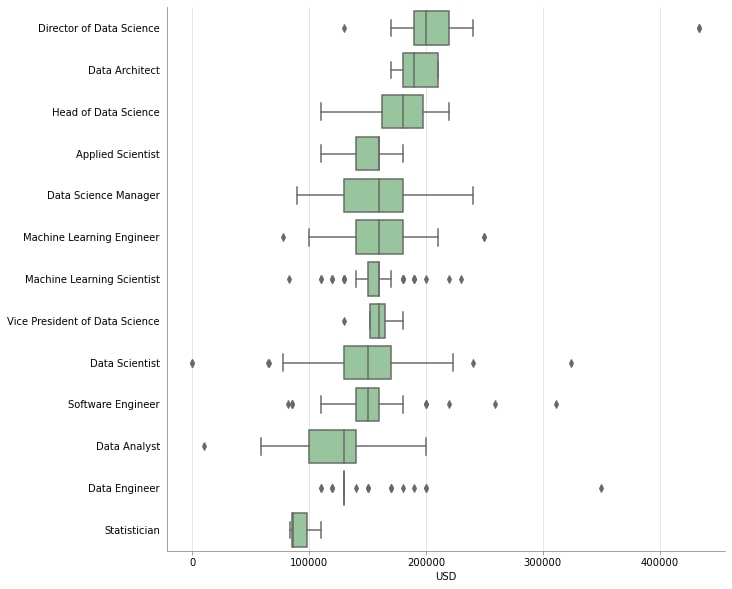
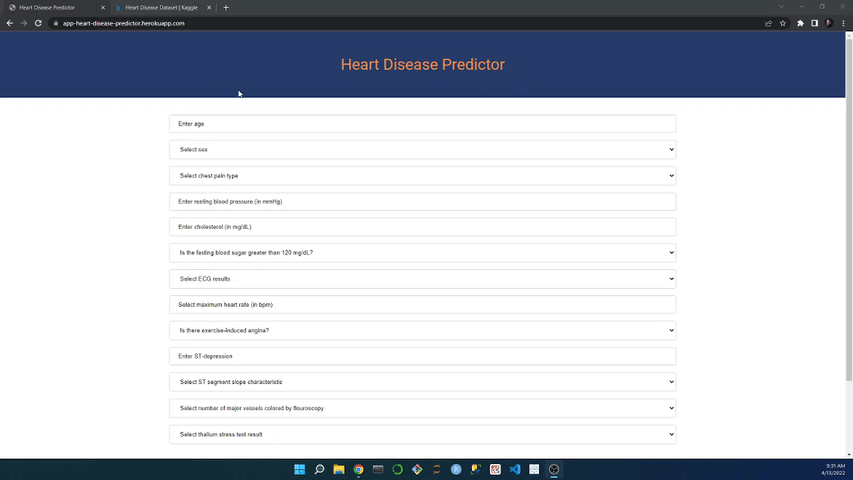

# [SimplyHired Data Science Jobs Exploratory Data Analysis](https://github.com/michaelabryant/simplyhired-eda)
- Scraped and cleaned 1342 job postings consisting of 422 variables from SimplyHired.com
- Performed an exploratory data analysis to determine the most frequently posted job titles, qualifications, and job benefits
- Regressed salary onto 986 predictors, and used a Bonferroni correction to determine statistically significant predictors and their impact on salary

<figure>
 
</figure>

# [Heart Disease Predictor App](https://github.com/MichaelBryantDS/heart-disease-prediction)
- Created nine classification machine learning models to make a prediction of heart disease using 303 patient records and 12 features
- Performed an exploratory data analysis and feature engineered a categorical risk factors variable based on high cholesterol, high blood pressure, high fasting blood sugar, and age for increased risk for each sex
- Hyperparameter tuned the models with a five-fold cross-validation and, for the best model, obtained a recall of 85.5% from the test set
- Deployed the best model with a [front-end](https://app-heart-disease-predictor.herokuapp.com/) hosted on a cloud application platform which can be used by doctors for evaluating patients

<figure>
 
</figure>

# [Vehicle Sales Price Recommender App](https://github.com/MichaelBryantDS/vehicle-price-rec)
- Created 12 regression machine learning models to make a prediction of vehicle sales price using 301 vehicle sales records and seven features
- Performed an exploratory data analysis and feature engineered dummy variables for categorical data
- Hyperparameter tuned the models with a five-fold cross-validation and, for the best model, obtained an MAE score of $502.69 and R-squared score of 0.9703 from the test set
- Deployed the best model with a [front-end](https://recommend-vehicle-price.herokuapp.com/) hosted on a cloud application platform which can be used to suggest a sales price to people interested in selling their vehicle

<figure>
 
</figure>

# [Bird Identifier App](https://github.com/MichaelBryantDS/bird-identifier)
- Created a convolution neural network to classify photos of birds based on species using 39364 photos and 275 species
- Selected pre-trained model for transfer learning based on initial performance
- Hyperparameter tuned the selected model and modified model architecture to increase accuracy to 96.9%
- Deployed the front-end with Flask on my local machine which can be used by users to upload photo of birds for identification

<figure>
 
</figure>

