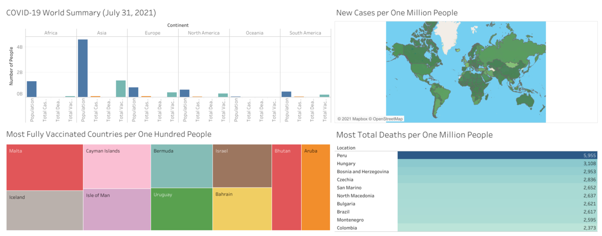
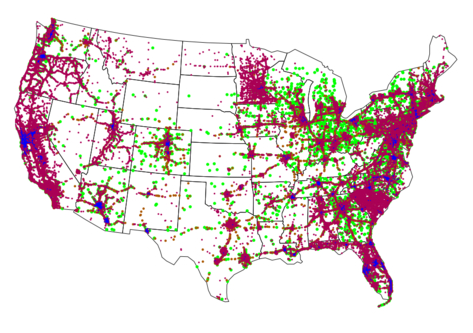
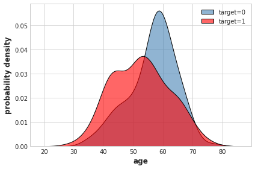
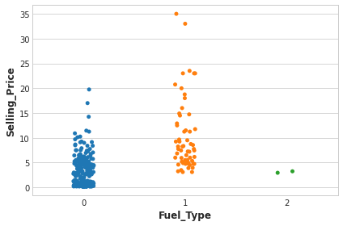
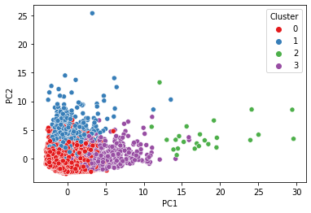

# [Project 1: COVID-19 EDA (SQL and Tableau)](https://github.com/MichaelBryantDS/COVID19-EDA)
- Performed an exploratory data analysis on a dataset consisting of 106,357 records and 59 variables
- Created two dashboards to visualize cases, deaths, vaccinations, hospitalizations, and testing for the World and US
- Queries and visualizations can be used for creating an application for giving a daily summary of COVID-19

# [Project 2: US Vehicle Accidents EDA (Python)](https://github.com/MichaelBryantDS/US-Vehicle-Accidents-EDA)
- Performed an exploratory data analysis on a dataset consisting of 2.9 million accident records and 47 variables
- Cleaned data by imputation and finding missing data through a Python library and API
- Engineered features by creating dummy variables for cateogrical and string data
- Wrangled data can be used by data analytics team to make predictions of accident severity

# [Project 3: Heart Disease Prediction (Python)](https://github.com/MichaelBryantDS/Heart-Disease-Prediction)
- Created seven machine learning models to make a classification prediction of heart disease using 303 patient records and 12 features
- Performed an exploratory data analysis and feature engineered a categorical risk factors variable based on high cholesterol, high blood pressure, high fasting blood sugar, and age for increased risk for each sex
- Hyperparameter tuned the models and, with a five-fold cross validation, obtained an accuracy of 85.5% and AUC score of 0.941
- Predictive model can be used to give patients the probability of having heart disease within a confidence interval

# [Project 4: Vehicle Sales Price Prediction (Python)](https://github.com/MichaelBryantDS/Vehicle-Sales-Price-Prediction)
- Created seven machine learning models to make a regression prediction of vehicle sales price using 301 vehicle sales records and seven features
- Performed an exploratory data analysis and feature engineered dummy variables for categorical data
- Hyperparameter tuned the models and, with a five-fold cross validation, obtained an MAE score of $549.80 and R-squared score of 0.969
- Predictive model can be implemented onto a website for advertising cars for sale to suggest a sales price to the seller

# [Project 5: Credit Card Users Cluster Analysis (Python)](https://github.com/MichaelBryantDS/Credit-Card-Users-Cluster-Analysis)
- Performed an exploratory data analysis on a dataset consisting of 8950 credit card user records and 18 variables
- Determined a majority of the explained variance, using principal component analysis, was due to users using their credit cards for cash advances or purchases
- Clustered users into groups based on credit card usage which can be used to target users with specific credit card offers

# [Project 6: Bird Species Prediction (Python)](https://github.com/MichaelBryantDS/Bird-Species-Prediction)
- Created a convolution neural network to classify photos of birds based on species using 39364 photos and 275 species
- Selected pre-trained model for transfer learning based on initial performance
- Hyperparameter tuned the selected model and modified model architecture to increase accuracy to 95.2%
- Predictive model can be used for a phone app to allow the user to take a photo of a bird and receive a prediction of the species

