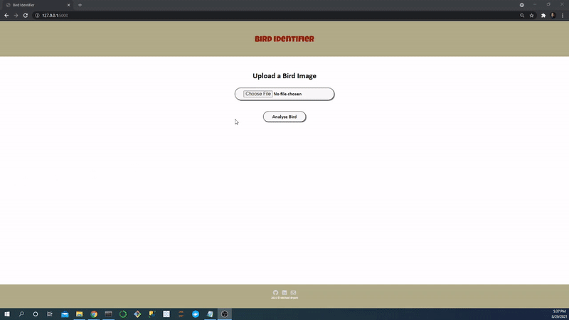
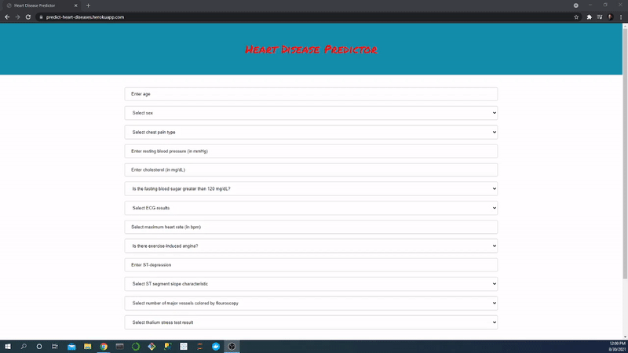
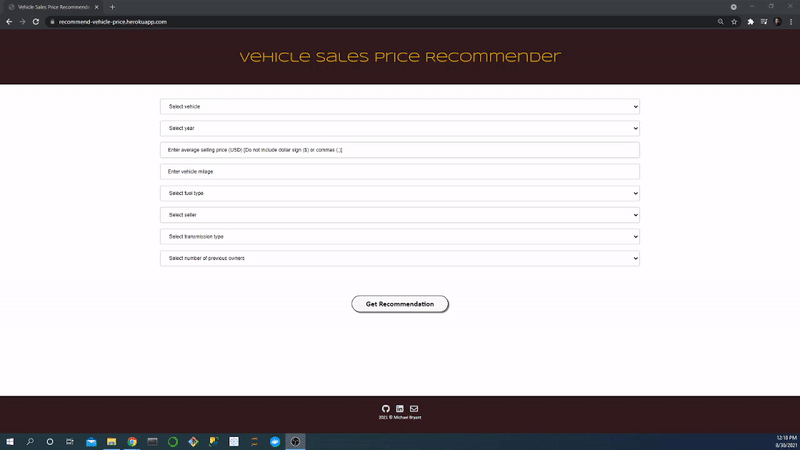

# [Bird Identifier App](https://github.com/MichaelBryantDS/bird-identifier)
- Created a convolution neural network to classify photos of birds based on species using 39364 photos and 275 species
- Selected pre-trained model for transfer learning based on initial performance
- Hyperparameter tuned the selected model and modified model architecture to increase accuracy to 96.9%
- Deployed the front-end with Flask on my local machine which can be used by users to upload photo of birds for identification

<figure>
 
</figure>

# [Heart Disease Predictor App](https://github.com/MichaelBryantDS/heart-disease-pred)
- Created 13 classification machine learning models to make a prediction of heart disease using 303 patient records and 12 features
- Performed an exploratory data analysis and feature engineered a categorical risk factors variable based on high cholesterol, high blood pressure, high fasting blood sugar, and age for increased risk for each sex
- Hyperparameter tuned the models with a five-fold cross-validation and, for the best model, obtained an accuracy of 85.5% from the test set
- Deployed the best model with a [front-end](https://predict-heart-diseases.herokuapp.com/) hosted on a cloud application platform which can be used by doctors for evaluating patients

<figure>
 
</figure>

# [Vehicle Sales Price Recommender App](https://github.com/MichaelBryantDS/vehicle-price-rec)
- Created 12 regression machine learning models to make a prediction of vehicle sales price using 301 vehicle sales records and seven features
- Performed an exploratory data analysis and feature engineered dummy variables for categorical data
- Hyperparameter tuned the models with a five-fold cross-validation and, for the best model, obtained an MAE score of $502.69 and R-squared score of 0.9703 from the test set
- Deployed the best model with a [front-end](https://recommend-vehicle-price.herokuapp.com/) hosted on a cloud application platform which can be used to suggest a sales price to people interested in selling their vehicle

<figure>
 
</figure>

# [COVID-19 EDA](https://github.com/MichaelBryantDS/covid-19-july-31-2021)
- Performed an exploratory data analysis on a COVID-19 dataset consisting of 106,357 records and 59 variables recorded from the first case to July 31, 2021
- Created two dashboards with eight visualizations of cases, deaths, vaccinations, hospitalizations, and testing for the World and the US
- Queries and visualizations can be used to automate reports to give daily summaries of the status of COVID-19 to users through an app

# [US Vehicle Accident Severity EDA and Data Cleaning](https://github.com/MichaelBryantDS/accident-severity)
- Performed an exploratory data analysis on a 1 GB dataset consisting of 2.9 million accident records and 47 variables
- Cleaned data by imputation and by finding missing data through a Python library and API
- Prepared data can be used to make models for predictioning accident severity based on date, time, and weather for emergency response services

# [Credit Card Users Cluster Analysis](https://github.com/MichaelBryantDS/credit-card-cluster)
- Performed an exploratory data analysis on a dataset consisting of 8950 credit card user records and 18 variables
- Determined a majority of the explained variance, using principal component analysis (PCA), was due to users using their credit cards for purchases and cash advances
- Performed two cluster analyses based on the PCA resulting in 16 categories of users to target with different advertisements
- Hyperparameter tuned models with a five-fold cross-validation and, for the best models, obtained an accuracies of 99.3% and 99.8% from the test sets (used to predict two sets of clusters)
- Deployed the best model with a [front end](https://ad-advisor.herokuapp.com/) hosted on a cloud application platform which can be used to consult credit card companies on the most efficient ads
